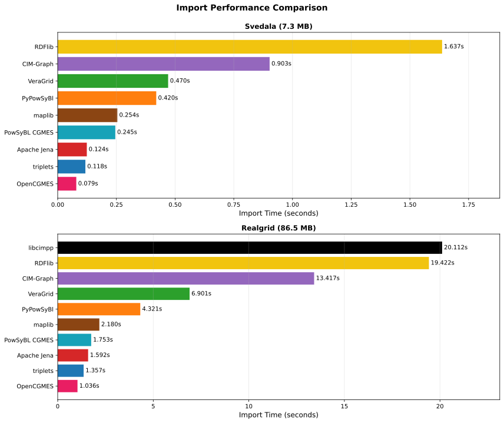
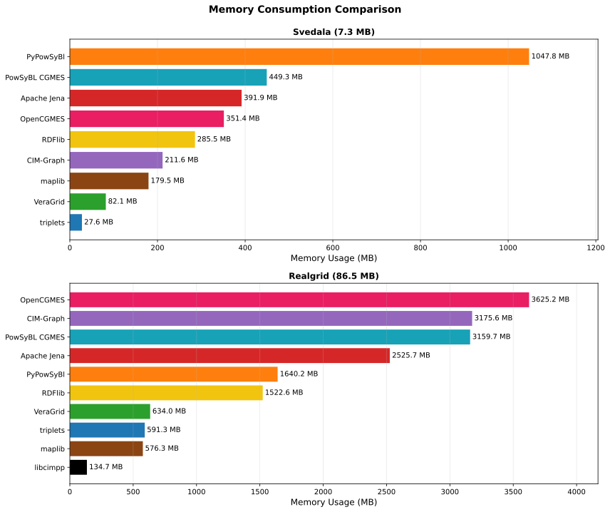
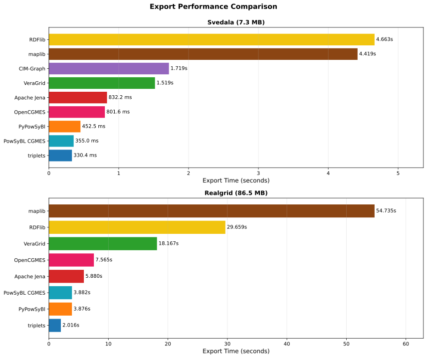

# cim-bench

Performance benchmarking suite for CIM (Common Information Model) parsers and serializers.
Measures load time, memory usage, query, and export performance of tools parsing
CGMES (Common Grid Model Exchange Standard) XML/RDF files, each in its own container.

## Results

**All numbers are generated from benchmark runs — nothing below is maintained by hand.**

- 📊 **[Interactive results site](https://haigutus.github.io/cim-bench/)** — sortable/filterable tables with versions and tags, all graphs
- 📄 [Comparison summary](results-docker/comparison_summary.md) — generated markdown tables
- 📁 [Detailed per-tool reports](results-docker/) — `*_benchmark_report.md` per tool and dataset
- 📈 [All graphs](results-docker/graphs/) — SVG charts, regenerated on every run





### Measurement notes

> **⚠️ Query performance is not directly comparable across parsers.** Some parsers
> (triplets) retrieve **all element data with parameters**, while others use SPARQL
> `COUNT()` queries that only return **element counts**. Retrieving full data is
> 10-100x slower but provides complete element information.

- **pypowsybl** converts some substations to voltage levels when connected by transformers, so it reports fewer substations on RealGrid.
- **maplib** exports N-Quads dramatically faster than RDF/XML; the benchmark uses RDF/XML for consistency with other tools.
- **libcimpp** is only benchmarked on RealGrid (CGMES 2.4.15) — its CGMES 3.0 build fails on Svedala's European extensions.
- **CLI-only tools** (🖥️) are benchmarked as subprocesses (full process lifecycle per run) and are reported as a **separate family**, never mixed into the library charts.
- **All available profiles must load** (merged or as separate models) for a tool's benchmarks to count — partial loads are skipped (`IncompleteLoadError` → pytest skip), so every load number covers the same data.

## Parsers/Serializers

Tool versions and performance live in the [generated results](https://haigutus.github.io/cim-bench/); this table is the curated overview.

| Status | Tool / Library | Language | Main Purpose / Strength | Triplet / Graph Access? | CGMES / CIM Support | GitHub / Source | Notes |
|--------|----------------|----------|-------------------------|------------------------|---------------------|-----------------|-------|
| ✅ | **triplets** | Python | Pandas-based RDF parser | pandas DataFrames + lxml | Version-agnostic CIM/CGMES | [triplets](https://github.com/Haigutus/triplets) | Fast loading, low memory, simple API — data extraction, batch processing |
| ✅ | **pypowsybl** | Python | PowSyBl wrapper (network import/export) | Native network model (Java) | CGMES 2.4.15/3.0 import/export | [powsybl/pypowsybl](https://github.com/powsybl/pypowsybl) | Rich analysis-ready network model — power flow, TSO applications |
| ✅ | **GridCal/VeraGrid** | Python | Power systems analysis with UI | Custom CGMES parser | CGMES 2.4.15/3.0 import | [SanPen/GridCal](https://github.com/SanPen/GridCal) | Fastest queries (O(1) object access), full circuit model — query-intensive workflows |
| ✅ | **RDFlib** | Python | Generic RDF parser/triple store | Oxigraph (via oxrdflib) | None (generic) | [RDFLib/rdflib](https://github.com/RDFLib/rdflib) | Standard RDF library, flexible SPARQL — baseline for speed/memory comparison |
| ⚠️ | **CIMantic Graphs** | Python | In-memory labeled property graph | Oxigraph + typed objects | CIM15–18, custom profiles | [PNNL-CIM-Tools/CIM-Graph](https://github.com/PNNL-CIM-Tools/CIM-Graph) | Sub-microsecond queries, modern typed API; **benchmarks currently skipped** — v0.4.3 fails to load the SSH/TP profiles of both test datasets (AttributeError on stubbed objects), so numbers would cover partial loads only |
| ✅ | **Apache Jena** | Java (JPype) | RDF framework + CIMXML parser | In-memory RDF triples | Generic RDF | [apache/jena](https://github.com/apache/jena) | Generic RDF, lenient UUID handling — semantic web applications |
| ✅ | **OpenCGMES** | Java (JPype) | Suite for CGMES / CIM RDF parser | Apache Jena (optimized) | CGMES / IEC61970-552 | [SOPTIM/OpenCGMES](https://github.com/SOPTIM/OpenCGMES) | Fast loading, CGMES optimizations, UUID normalization — production systems |
| ✅ | **PowSyBL CGMES** | Java (JPype) | CGMES model with triplestore | RDF4J triplestore | CGMES 2.4.15/3.0 | [powsybl/powsybl-core](https://github.com/powsybl/powsybl-core) | Fast SPARQL queries, robust triplestore — CGMES analysis, PowSyBl integration |
| ✅ | **maplib** | Python/Rust | High-performance RDF with SPARQL | Polars DataFrames + Oxigraph | Generic RDF (CGMES compatible) | [DataTreehouse/maplib](https://github.com/DataTreehouse/maplib) | Rust-backed, sub-millisecond queries, DataFrame output — data pipelines |
| ⚠️ | **libcimpp** | C++ (Python wrapper) | Fast C++ object model | Native C++ objects | CGMES 2.4.15 (3.0 partial) | [sogno-platform/libcimpp](https://github.com/sogno-platform/libcimpp) | Lowest memory usage — memory-constrained environments; CGMES 3.0 fails on Svedala |
| ✅ | 🖥️ **cimgo** | Go (CLI) | CGMES validator + converter | CLI only (validate/convert) | CGMES 2.4.15/3.0 | [m-mirz/cimgo](https://github.com/m-mirz/cimgo) | **CLI-only** — benchmarked as subprocess; SHACL & SPARQL validation, JSON/CGMES/Protobuf conversion |
| ⚠️ | **GridLab GMSS CIM** | C# / .NET | Strongly-typed CIM models + code generator | Typed .NET objects | CGMES 2.4.15/3.0.0 | [gms-squared/gridlab.gmss.cim](https://gitlab.com/gms-squared/modules/gridlab.gmss.cim) | Benchmarked in-process via pythonnet; Svedala works, RealGrid rejected (strict IEC 61970-552 URI validation) |
| 📋 | 🖥️ **cimd** | Zig (CLI) | Fast CGMES parser — validate, convert, query, browse, diff | CLI only | CGMES (SHACL + QoCDC validation) | [cimd.eu](https://cimd.eu) · [source](https://codeberg.org/caspereijkens/cimd) | **CLI-only** (Apache 2.0) — integration parked on the `cimd` branch: v0.4.0 cannot load all profiles (one file per invocation, ZIP reads only EQ, `convert` lacks SV and panics on RealGrid EQ); merges once upstream supports full profile sets |
| ✅ | **cimoxide** | Rust | CGMES struct generation, SHACL validation | Typed Rust structs | ENTSO-E RDF/SHACL | [m-mirz/cimoxide](https://github.com/m-mirz/cimoxide) | Benchmarked in-process via its published PyO3 wheels (`cimoxide` on PyPI); Svedala and RealGrid both work |
| ✅ | 🖥️ **pocket-rdf** | Python (CLI) | RDF load/serialize/query/validate toolkit | CLI only (SPARQL/SHACL) | Generic RDF | [EHegyi-Sphericity/pocket-rdf](https://github.com/EHegyi-Sphericity/pocket-rdf) | **CLI-only** (Typer, rdflib-based) — benchmarked as subprocess (serialize + SPARQL count query); SHACL validate not benchmarked (no shapes) |
| ⚠️ | **cimpy** | Python | Import/export/modify CGMES XML/RDF | Object topology dict | CGMES 2.4.15 (partial) | [sogno-platform/cimpy](https://github.com/sogno-platform/cimpy) | v1.1.0 lacks CGMES 3.0 classes, parsing bugs with test datasets |
| ❌ | **pycgmes** | Python | Dataclasses + RDF schema + SHACL | Dataclass mapping | CGMES 3.0+ | [alliander-opensource/pycgmes](https://github.com/alliander-opensource/pycgmes) | No file import capability - dataclass definitions only |
| 📋 | **CIMverter** | Java/C++ | Convert CIM RDF to Modelica | Partial | CGMES compatible | [cim-iec/cimverter](https://github.com/cim-iec/cimverter) | Round-trip fidelity testing |
| 📋 | **CIMDraw** | Web/JS | View/edit CGMES node-breaker models | Indirect | ENTSO-E CGMES profile | [danielePala/CIMDraw](https://github.com/danielePala/CIMDraw) | Visual completeness check |
| ⚠️ | **GraphDB** | Java (JPype) | Enterprise RDF database with SPARQL | Embedded via RDF4J API | Generic RDF | [Ontotext GraphDB](https://www.ontotext.com/products/graphdb/) | Benchmarked embedded (graphdb-runtime 10.8, bundled free Lite license, **1 CPU core**); persistent store — load includes disk writes; 11.x requires a purchased license even for the server, so 10.8 is the last free-benchmarkable series |
| 📋 | **CIMbion** | TBD | CIM/CGMES data management | TBD | CGMES | [Veracity Store](https://store.veracity.com/cimbion) | Closed source, commercial |
| 📋 | **CIMdesk** | Various | CIM data management | TBD | CGMES | TBD | To be investigated |

**Legend:**
- ✅ Benchmarked
- ⚠️ Compatibility issues found
- ❌ Not suitable for import benchmarking
- 📋 Planned
- 🖥️ CLI-only tool — no library/programmatic API; benchmarked as a subprocess in a separate result family

### 📊 Additional Benchmarks

| Test Category | Description | Metrics | Why Important |
|---------------|-------------|---------|---------------|
| **Export/Serialization** | Write loaded CIM data back to RDF/XML | Time, file size, memory | Round-trip capability, data export use cases |
| **Round-trip Fidelity** | Load → Export → Load → Diff check | Time, diff count, data loss % | Data integrity, lossless conversion verification |
| **SHACL Validation** | Validate CIM models against SHACL shapes | Time, violations found, memory | Data quality, CGMES compliance checking |
| **SPARQL Queries** | Complex graph queries on loaded data | Query time, result count | Advanced data extraction, relationship queries |

### 📁 Datasets

| Dataset | Size | CGMES Version | Network Type | Elements | Status | Purpose |
|---------|------|---------------|--------------|----------|--------|---------|
| **Svedala IGM** | 7.3 MB | CGMES 3.0 | Small (Sweden) | 97 lines, 39 gen, 73 loads, 56 subs | ✅ Active | Fast iteration, baseline tests |
| **RealGrid** | 86.5 MB (3.7 MB compressed) | CGMES 2.4.15 | Large (Pan-European) | 10,000+ elements | ✅ Active | Scalability, real-world TSO scenarios |
| **NC Profiles** | ~50-100 MB | CGMES 3.0 | Medium (ENTSO-E) | TBD | 📋 Planned | Network Code validation, cross-border |

## 🐳 Podman Containerization

**Isolated, reproducible benchmark environment per tool using uv-managed Python environments.**

- One container per tool with exact Python version and dependencies (`tool-configs/{tool}/pyproject.toml`)
- Benchmarks always run **sequentially** — parallel execution would let tools skew each other's measurements
- Source directories (`benchmarks/`, `parsers/`) are volume-mounted read-only, so **code changes never require image rebuilds**
- Dependency downloads are cached across builds (uv and Maven cache mounts), and the build context excludes datasets/results
- Rootless Podman: no daemon, no root privileges

### Quick Start
```bash
# Build all Podman images (or just some: ./docker/setup.sh triplets rdflib)
./docker/setup.sh

# Run all benchmarks in containers (sequential, includes reports/graphs/site generation)
./docker/run_benchmark.sh

# Run a subset of tools, skip already-benchmarked ones
./docker/run_benchmark.sh --tools triplets,rdflib --skip-existing

# Run a single tool+dataset (also refreshes reports/graphs/site with all prior results)
./docker/run_single.sh triplets svedala

# Regenerate reports/comparison/graphs/site without running anything
./docker/generate_outputs.sh
```

Every run — full or single-tool — regenerates the markdown reports, the comparison
summary, the SVG graphs, and the [results site](https://haigutus.github.io/cim-bench/)
(`docs/`, published via GitHub Pages) from **all** JSON results on disk. Rerunning one
tool is enough to refresh everything.

### Architecture
```
docker/
├── base.dockerfile              # Debian + uv (no source - mounted at runtime)
├── tools/{tool}.dockerfile      # Per-tool deps (Python via uv, Java via Maven, C++ builds)
├── docker-compose.yml           # Single source of truth for benchmarks
├── setup.sh                     # Build images (all, or named tools as args)
├── run_benchmark.sh             # Run benchmarks (--tools, --skip-existing) + outputs
├── run_single.sh                # Run one tool+dataset, then regenerate outputs
└── generate_outputs.sh          # Reports + comparison + graphs + site from existing JSONs

tool-configs/{tool}/pyproject.toml   # Exact Python version + dependencies per tool
```

Containerized benchmarks validated against native execution (5-8% overhead; see `CONTAINERIZATION_VALIDATION.md`).

## Getting Started

### Prerequisites

This repository uses **Git LFS** for large dataset files. Install it before cloning:

```bash
# Ubuntu/Debian: sudo apt-get install git-lfs   |   macOS: brew install git-lfs
git lfs install
```

For containerized execution install Podman:

```bash
# Fedora: sudo dnf install podman podman-compose
# Ubuntu/Debian: sudo apt-get install podman podman-compose
# macOS: brew install podman podman-compose
```

### Quick Setup

```bash
git clone --recurse-submodules https://github.com/Haigutus/cim-bench.git
cd cim-bench

# Automated: installs uv, Git LFS, pulls submodules and LFS files, installs dependencies
./setup.sh

# Optional: visualization dependencies (matplotlib for graphs)
uv sync --extra visualization
```

### Running Benchmarks (native)

```bash
./run_benchmarks.sh                    # all native benchmarks + reports + graphs
./run_benchmarks.sh --quick            # fewer rounds, faster iteration
./run_benchmarks.sh --skip-existing    # skip benchmarks with existing results
```

Results land in `results/` (native) as pytest-benchmark JSON plus generated markdown
reports and `results/graphs/*.svg`. Java-dependent tools (`docker_*` benchmark files)
only run containerized.

Manual execution:
```bash
uv run pytest benchmarks/triplets_svedala_benchmark.py --benchmark-only
uv run python tools/generate_report.py results/output.json results/output_report.md
uv run python tools/generate_comparison.py results/*.json results/comparison.md
uv run python tools/generate_graphs.py results
uv run python tools/generate_site.py results-docker docs
```

### Running Benchmarks with Podman

See [Quick Start](#quick-start) above. Manual single-container execution:

```bash
podman run --rm \
  -v $(pwd)/benchmarks:/benchmarks:ro,z \
  -v $(pwd)/parsers:/benchmarks/parsers:ro,z \
  -v $(pwd)/data:/benchmarks/data:ro,z \
  -v $(pwd)/results-docker:/output:z \
  cim-bench/triplets:latest \
  pytest triplets_svedala_benchmark.py --benchmark-only --benchmark-min-rounds=3
```

**Note**: the source mounts are required — images do not bake in `benchmarks/`/`parsers/`.
The `:z` flag enables SELinux relabeling (required on Fedora/RHEL).

## Contributing

Each new tool integration lives on its own git branch (e.g. `cimgo`, `gmss`) and is
merged to master when validated. Add adapters and benchmark files in `parsers/` and
`benchmarks/` following the adapter pattern — see `CLAUDE.md` for the full workflow,
including tool tags, CLI-only tools, and language bridges (JPype, pythonnet, PyO3, pybind11).
